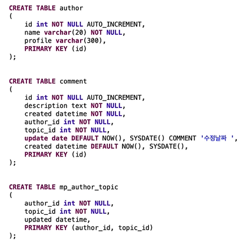

# 들어가면서

이해하기 어려운것들이 있을것 같아서 글로 최대한 간단히 관계형 DB 모델링부터, 

정규화/역정규화까지 한번 알아보도록 하겠습니다~

일단 관계형 DB 모델링의 순서는 다음의 순서로 진행되요.

1. **업무파악**
2. **개념적 데이터 모델링**
3. **논리적 데이터 모델링**
4. **물리적 데이터 모델링**

\*\*\*\*

**업무파악**에서는 어떤 기능을 꿈꾸고 있으며 희망하는지를 알아내는 것을 진행합니다.

즉, 어떤 사이트를 구축하고 싶은지 그 목적을 알아야 우리도 대충 흐름을 이해할 수 있겠죠? 

**개념적 데이터 모델링**에서는 업무파악에서 얻어낸 정보들을 바탕으로 모두 뜯어내고 나열해서 어떤 개념들과 어떤 상호작용이 있는지를 파악하게 됩니다.

**논리적 데이터 모델링**에서는 만들어진 개념들을 이상적인 표로 만들어내는 것입니다.

**물리적 데이터 모델링**에서는 어떤 DB를 이용해 구현할지 선택하고 SQL문을 통해 구현하게됩니다. 

